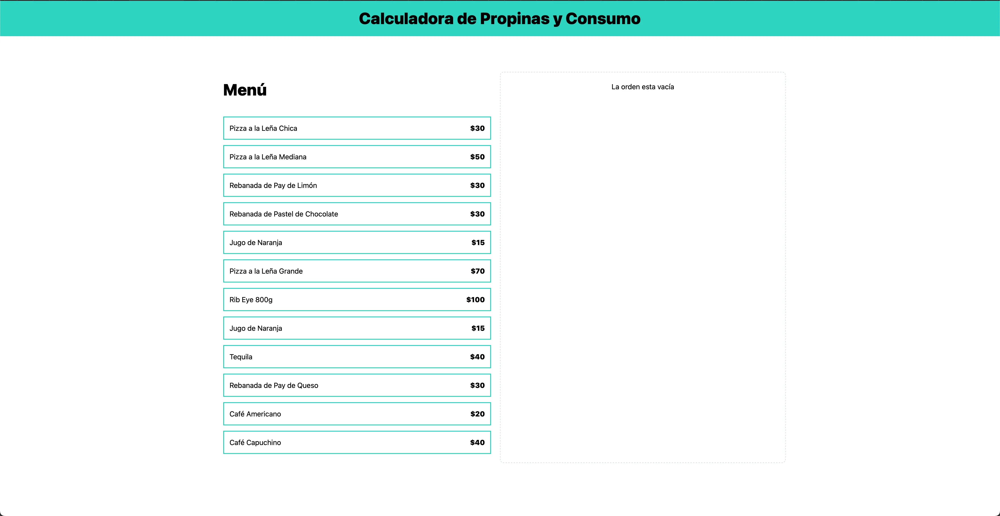

# Calculadora Propinas - Udemy Course


## Dependencies
Before Start, you need to install necessary dependencies, run this command:

```bash
npm install
```

## Start Vite Local Server
run the following command to start you development area:

```bash
npm run dev
```
